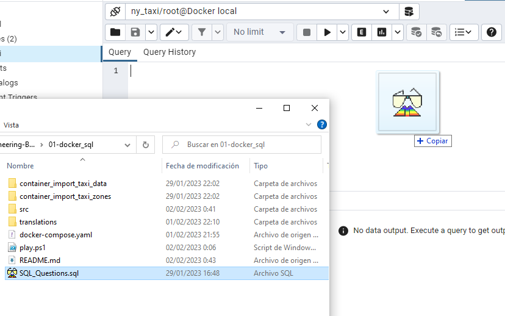

Más idiomas: <kbd>[](translations/README.en.md)</kbd>  &emsp;
Seguime en <kbd>[](https://www.linkedin.com/in/martinezjesusfl/)</kbd>

# Proceso de ETL y Análisis Exploratorio

**Tecnologías usadas:**  
 &emsp;
 &emsp;
 &emsp;


## Index
- [Inventario](#Inventario)
- [Instrucciones](#Instrucciones)
- [Configurar el servidor](#Configurando-el-servidor-en-PgAdmin)

## Inventario
Vamos a encontrar los siguientes archivos y directorios:
- ```container_import_taxi_data``` La carpeta con el Dockerfile para crear el contenedor para importar en Postgres los datos de viajes en taxi y el script en python correspondiente
- ```container_import_taxi_zones``` La carpeta con el Dockerfile para crear el contenedor para importar en Postgres los datos de las zonas de viajes en taxi y el script en python correspondiente
- ```docker-compose.yaml``` para levantar la base de datos de Postgres junto con el servidor de PgAdmin. Ambos con en una red de Docker expuesta para que los contenedores anteriores puedan apuntar el proceso de ETL a la DB
- ```powershell_script.ps1``` Un script en formato PowerShell que servirá como acceso directo para realizar todos los pasos de crear los contenedores, levantar los servicios, realizar el proceso de ETL e ingresar a la interfaz de PgAdmin.
- ```SQL_Questions.sql``` para explorar las consultas a Postgres resolviendo preguntas básicas de un análisis exploratorio

## Instrucciones
Las siguientes instrucciones están redactadas para ejecutarse en la terminal de PowerShell. Para usarlas en tu terminal preferida tenés que adaptar la sintaxis (por ejemplo los saltos de línea)

### 1. Crear el container import_taxi_data
``````
docker build -t import_taxi_data:v001 ./container_import_taxi_data
``````

### 2. Crear el container import_taxi_zones
``````
docker build -t import_taxi_zones:v001 ./container_import_taxi_zones
``````

### 3. Levantar los servicios de Postgres y PgAdmin4
``````
docker-compose up -d
``````

### 4. Cargar los datos de viajes en taxi a la db en Postgres
Set the variable for the file [green_tripdata_2019-01.csv.gz](https://github.com/DataTalksClub/nyc-tlc-data/releases/download/green/green_tripdata_2019-01.csv.gz)

``````
$URL='https://github.com/DataTalksClub/nyc-tlc-data/releases/download/green/green_tripdata_2019-01.csv.gz'
``````

Run the ```import_taxi_data``` container

``````
docker run -it `
    --network=docker_sql_postgresdb `
    import_taxi_data:v001 `
    --user=root `
    --password=root `
    --host=pgdatabase `
    --port=5432 `
    --db=ny_taxi `
    --table_name=green_taxi_data `
    --url=${URL}
``````

### 5. Cargar los datos de zonas de viajes en taxi a la db en Postgres
Set the variable for the file [taxi+_zone_lookup.csv](https://s3.amazonaws.com/nyc-tlc/misc/taxi+_zone_lookup.csv)

``````
$URL='https://s3.amazonaws.com/nyc-tlc/misc/taxi+_zone_lookup.csv'
``````

Run the ```import_taxi_zones``` container

```
docker run -it `
    --network=docker_sql_postgresdb `
    import_taxi_zones:v001 `
    --user=root `
    --password=root `
    --host=pgdatabase `
    --port=5432 `
    --db=ny_taxi `
    --table_name=taxi_zones `
    --url=${URL}
``````

## Configurando el servidor en PgAdmin

### 1. Login
User: admin@admin.com
Password: root

### 2. Adding the server
Una vez logeados, podemos encontrarnos con el Home o simplemente con el panel de la izquierda. Tenemos que registrar el servidor de nuestra base de datos


Usá el nombre que quieras en la pestaña ```General```.  
Luego entrá en la pestaña ```Connection``` y guardá los siguientes ajustes:
- Host name/address: pgdatabase
- Port: 5432
- Username: root
- Password: root


### 3. Abrir el query editor
Expandí el navegador de la izquierda hasta llegar a la db ```ny_taxi```.  
Presioná ```Alt+Shift+Q``` para abrir el query editor


Arrastrá el archivo ```.sql``` adentro del query editor


