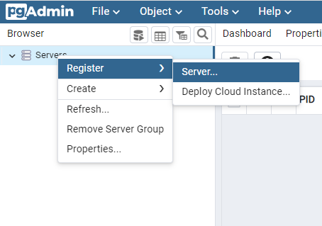
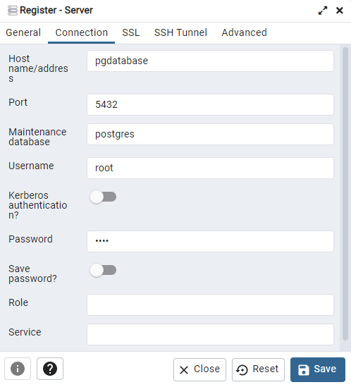
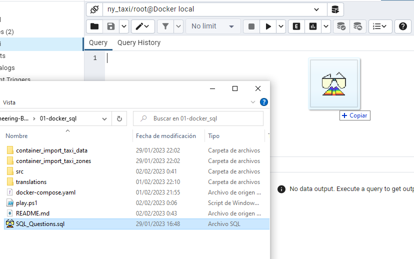

Other languages: <kbd>[](../README.md)</kbd>  &emsp;
Follow me on <kbd>[](https://www.linkedin.com/in/martinezjesusfl/)</kbd>

# Data Ingestion Process and Exploratory Analysis

**Tech Stack:** 
<kbd></kbd>
<kbd></kbd>
<kbd></kbd>

## Index
- [Inventory](#Inventory)
- [Instructions](#Instructions)
- [Configurar el servidor](#Agregar-el-servidor-en-PgAdmin)

## Inventory
We have the next files and directories:
- ```container_import_taxi_data``` the folder with the Dockerfile to setup the green taxi trips data container and its python script for extraction and ingest into postgres database
- ```container_import_taxi_zones``` the folder with the Dockerfile to setup the taxi zones container and its python script for extraction and ingest into postgres database
- ```docker-compose.yaml``` to run postgres and pgadmin services within a one line command
- ```powershell_script.ps1``` which will serve as an easy way to run all the build, extraction process, and finally open PgAdmin4 interface
- ```SQL_Questions.sql``` to run the queries for the SQL homework

## Instructions
The following commands are suitable for PowerShell terminal. You should adapt it to the command line of your liking

### 1. Build import_taxi_data container
``````
docker build -t import_taxi_data:v001 ./container_import_taxi_data
``````

### 2. Build import_taxi_zones container
``````
docker build -t import_taxi_zones:v001 ./container_import_taxi_zones
``````

### 3. Run Postgres and PgAdmin4 services 
``````
docker-compose up -d
``````

### 4. Ingest green taxi trips data
Set the variable for the file [green_tripdata_2019-01.csv.gz](https://github.com/DataTalksClub/nyc-tlc-data/releases/download/green/green_tripdata_2019-01.csv.gz)

``````
$URL='https://github.com/DataTalksClub/nyc-tlc-data/releases/download/green/green_tripdata_2019-01.csv.gz'
``````

Run the ```import_taxi_data``` container

``````
docker run -it `
    --network=docker_sql_postgresdb `
    import_taxi_data:v001 `
    --user=root `
    --password=root `
    --host=pgdatabase `
    --port=5432 `
    --db=ny_taxi `
    --table_name=green_taxi_data `
    --url=${URL}
``````

### 5. Ingest taxi zones data
Set the variable for the file [taxi+_zone_lookup.csv](https://s3.amazonaws.com/nyc-tlc/misc/taxi+_zone_lookup.csv)
``````

$URL='https://s3.amazonaws.com/nyc-tlc/misc/taxi+_zone_lookup.csv'

``````

Run the ```import_taxi_zones``` container

```
docker run -it `
    --network=docker_sql_postgresdb `
    import_taxi_zones:v001 `
    --user=root `
    --password=root `
    --host=pgdatabase `
    --port=5432 `
    --db=ny_taxi `
    --table_name=taxi_zones `
    --url=${URL}
``````


## Agregar el servidor en PgAdmin

### 1. Login
User: admin@admin.com
Password: root

### 2. Adding the server
Once logged in, you will find either a home page or the browser pane with no servers. We need to register the db server



In the ```General``` tab name the server as you wish.  
Then switch to the ```Connection``` tab and set the following parameters:
- Host name/address: pgdatabase
- Port: 5432
- Username: root
- Password: root



### 3. Open a query editor
Expand the browser tree to get to the ```ny_taxi``` db.  
Press ```Alt+Shift+Q``` to open a query editor


Drag and drop the ```.sql``` file to the editor tab

